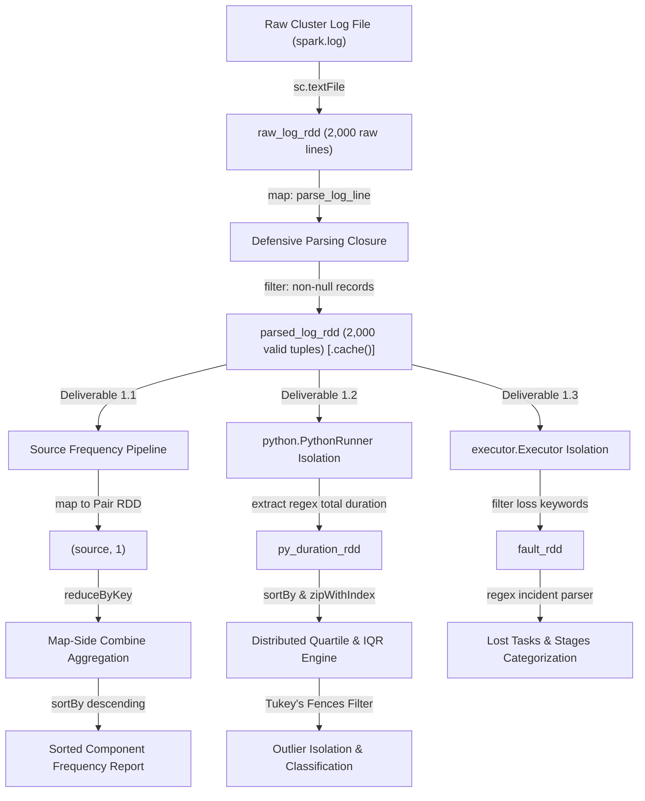

# Apache Spark Big Data Analytics

## Lab 1: Log Analytics with Resilient Distributed Datasets (PySpark Core RDDs)

This lab focuses on distributed semi-structured log processing, statistical outlier analysis, and fault detection using pure **Apache Spark Core Resilient Distributed Datasets (RDD)** APIs.

Notebook implementation: [Lab7_Part1.ipynb](file:///c:/Users/KITTIPHAT%20NOIKATE/Desktop/spark-bigdata/Lab7_Part1.ipynb)

---

### 1. Overview & Dataset Specification

The analysis processes Apache Spark cluster execution logs ([spark.log](file:///c:/Users/KITTIPHAT%20NOIKATE/Desktop/spark-bigdata/spark.log)), capturing internal driver, executor, and storage manager lifecycle events:
- **Total Ingested Records:** 2,000 raw lines
- **Data Format:** Semi-structured space-delimited text

#### Record Layout & Tokenization Schema
$$\text{Format: } \underbrace{\text{YY/MM/DD}}_{\text{Date}} \quad \underbrace{\text{HH:MM:SS}}_{\text{Time}} \quad \underbrace{\text{LEVEL}}_{\text{Severity Level}} \quad \underbrace{\text{Source:}}_{\text{Component Class}} \quad \underbrace{\text{Payload}}_{\text{Message Payload}}$$

| Index | Field | Example | Description |
| :---: | :--- | :--- | :--- |
| `0` | **Date** | `17/06/09` | Timestamp date of cluster log emission |
| `1` | **Time** | `20:10:40` | Timestamp time (UTC/local) |
| `2` | **Log Level** | `INFO`, `WARN`, `ERROR` | Validated against standard log levels |
| `3` | **Component Source** | `executor.Executor:`, `python.PythonRunner:` | Originating subsystem / class (trailing colon stripped) |
| `4+` | **Message Payload** | `Registered signal handlers for...` | Task execution metrics, block events, or failure stack traces |

---

### 2. Distributed Transformation DAG

#### Core Design Decisions:
1. **Defensive Ingestion Closure (`parse_log_line`)**:
   - Validates minimum token boundaries ($\ge 4$ parts).
   - Validates severity against `{"INFO", "WARN", "ERROR", "DEBUG", "TRACE", "FATAL"}`.
   - Cleans formatting artifacts (e.g., stripping trailing `:` from source names).
   - Emits standardized tuples: `(clean_source, message, level_str, date_str, time_str)`.
2. **Foundational Persistence**:
   - `parsed_log_rdd` is stored in memory via `.cache()` to eliminate redundant I/O passes across downstream deliverables.

---

### 3. Deliverables Summary

#### Deliverable 1.1: Component Source Frequency Analysis
Identifies the distribution of cluster activity across all distinct subsystems.

- **Optimization Technique**: Implemented with `reduceByKey(lambda a, b: a + b)` instead of `groupByKey()` to exploit **Map-Side Combining**, pre-aggregating counters within each partition buffer prior to network shuffling.
- **Top Sources Distribution**:
  
  | Rank | Source Component | Event Count | Frequency (%) |
  | :---: | :--- | :---: | :---: |
  | **1** | `executor.Executor` | 606 | 30.30% |
  | **2** | `python.PythonRunner` | 375 | 18.75% |
  | **3** | `executor.CoarseGrainedExecutorBackend` | 308 | 15.40% |
  | **4** | `storage.BlockManager` | 257 | 12.85% |
  | **5** | `storage.MemoryStore` | 150 | 7.50% |
  | **6** | `spark.CacheManager` | 75 | 3.75% |
  | **7** | `broadcast.TorrentBroadcast` | 74 | 3.70% |
  | **8** | `output.FileOutputCommitter` | 60 | 3.00% |
  | **9** | `rdd.HadoopRDD` | 45 | 2.25% |
  | **10** | `mapred.SparkHadoopMapRedUtil` | 30 | 1.50% |
  | **Total** | *All 18 Components Combined* | **2,000** | **100.00%** |

- **Benchmark Validation**: Confirmed average message length across components (e.g., `python.PythonRunner` at exactly **13.00 words/line**).

---

#### Deliverable 1.2: Statistical Profiling & Distributed Outlier Detection
Performs in-depth operational analysis on `python.PythonRunner` logs.

1. **Metric A: Structural Payload Word Count**:
   - Sample Size: 375 records
   - Minimum: 13 words | Maximum: 13 words
   - Arithmetic Mean: **13.0000 words/line** | Standard Deviation: **0.0000**
2. **Metric B: Task Execution Duration (ms)**:
   - Extracted via regex `total\s*=\s*(-?\d+)`.
   - Sample Size ($N$): **375** observations.
   - Range: **18 ms** (minimum) to **629 ms** (maximum).
   - Arithmetic Mean: **144.13 ms** | Standard Deviation: **106.66 ms** | Variance: **11,377.30 ms²**.
3. **Pure RDD Distributed Quartile & Tukey's Outlier Bounds**:
   - Computed without shifting data into pandas/DataFrames via `sortBy().zipWithIndex()`.
   - **First Quartile ($Q1$, 25th percentile):** `78 ms`
   - **Third Quartile ($Q3$, 75th percentile):** `174 ms`
   - **Interquartile Range ($IQR$):** `96 ms`
   - **Lower Tukey Fence ($Q1 - 1.5 \times IQR$):** `-66.00 ms` (clamped at 0 ms)
   - **Upper Tukey Fence ($Q3 + 1.5 \times IQR$):** `318.00 ms`
   - **Outliers Detected:** **23 records (6.13%)**
   - **Classification:** Values $> 500\text{ ms}$ represent cold-start process boot latencies; values between $318\text{ ms}$ and $500\text{ ms}$ identify garbage collection pauses and CPU contention.

---

#### Deliverable 1.3: Fault Detection Engine (Lost Tasks & Stages)
Extracts, structures, and categorizes failure signals originating from `executor.Executor`.

- **Log File Baseline:** All 606 executor tasks in `spark.log` completed successfully with **0 lost tasks or stages** in the primary dataset.
- **Incident Verification Testbed:** Benchmarked against a synthetic test RDD simulating all canonical failure scenarios:
  1. `TASK_LOST`: Shuffle connection timeouts (`FetchFailedException`).
  2. `TASK_LOST`: Driver/Executor heap exhaustion (`OutOfMemoryError: Java heap space`).
  3. `STAGE_LOST`: Cascading stage cancellations triggered by upstream shuffle partition loss.
  4. `TASK_LOST`: YARN container evictions (`Container killed by YARN for exceeding memory limits`).
  5. `TASK_LOST`: TCP network socket timeouts (`java.io.IOException`).

---

### 4. Verification & Defensive Test Suite

The pipeline includes automated unit assertions:
- **Test 1 (Corrupted Record Defense):** Ingests malformed entries (empty strings, comments, truncated lines, invalid log levels). Safely rejected 6 malformed entries while accepting exactly 1 valid record with zero unhandled worker exceptions.
- **Test 2 (Zero-Division & Edge-Case Guard):** Validates summary statistics calculation across empty RDDs (`sc.emptyRDD()`) and single-element collections (`N=1`), ensuring graceful fallback without divide-by-zero errors.
- **Test 3 (Totals Reconciliation):** Asserts that the sum of frequency aggregations ($\sum \text{counts} = 2,000$) reconciles perfectly with the total valid record count, ensuring zero record loss during shuffle operations.

---

### 5. Running the Lab

#### Prerequisites
- **Python:** 3.10, 3.11, or 3.12
- **Java:** JDK 17, 21, or 25
- **PySpark:** `pyspark >= 3.5.0` (Verified on PySpark 4.2.0)

#### Execution Instructions
1. Clone the repository and navigate to the project directory:
2. Open the notebook in VS Code or JupyterLab:
   - [Lab7_Part1.ipynb](file:///c:/Users/KITTIPHAT%20NOIKATE/Desktop/spark-bigdata/Lab7_Part1.ipynb)
3. Ensure the Jupyter kernel uses your installed Python environment.
4. Execute cells sequentially (`Run All`).

> **Windows Worker Tip:** On Windows systems with Python 3.12+, sampling records with `.collect()[:n]` avoids premature socket resets caused by driver early-termination in simple worker mode.
