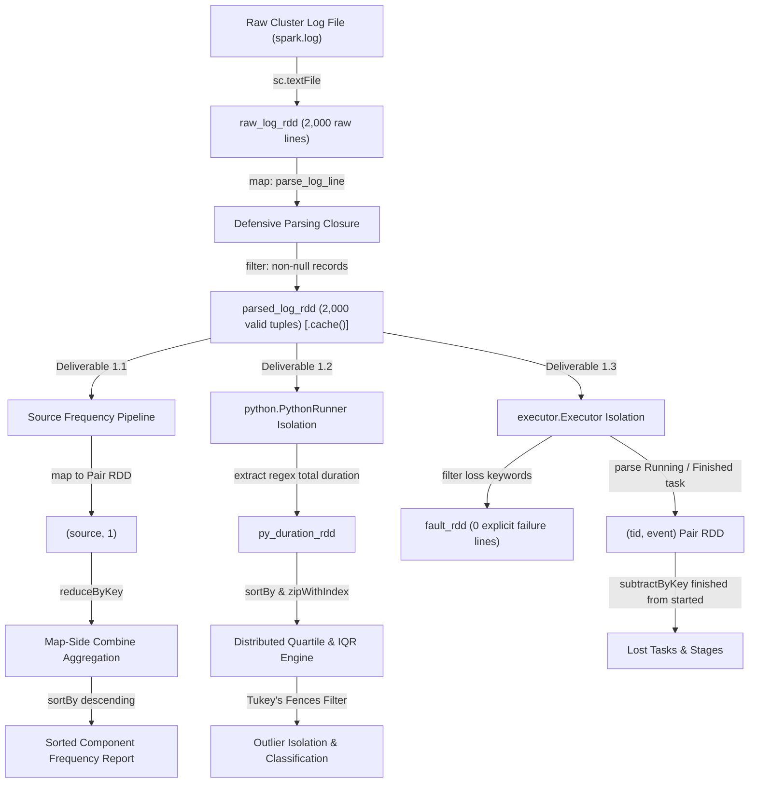

# Apache Spark Big Data Analytics

## Lab 1: Log Analytics with Resilient Distributed Datasets (PySpark Core RDDs)

This lab focuses on distributed semi-structured log processing, statistical outlier analysis, and fault detection using pure **Apache Spark Core Resilient Distributed Datasets (RDD)** APIs.

Notebook implementation: [Lab7_Part1.ipynb](Lab7_Part1.ipynb)

---

### 1. Overview & Dataset Specification

The analysis processes Apache Spark cluster execution logs ([spark.log](spark.log)), capturing internal driver, executor, and storage manager lifecycle events:
- **Total Ingested Records:** 2,000 raw lines
- **Data Format:** Semi-structured space-delimited text

#### Record Layout & Tokenization Schema
$$\text{Format: } \underbrace{\text{YY/MM/DD}}_{\text{Date}} \quad \underbrace{\text{HH:MM:SS}}_{\text{Time}} \quad \underbrace{\text{LEVEL}}_{\text{Severity Level}} \quad \underbrace{\text{Source:}}_{\text{Component Class}} \quad \underbrace{\text{Payload}}_{\text{Message Payload}}$$

| Index | Field | Example | Description |
| :---: | :--- | :--- | :--- |
| `0` | **Date** | `17/06/09` | Timestamp date of cluster log emission |
| `1` | **Time** | `20:10:40` | Timestamp time (UTC/local) |
| `2` | **Log Level** | `INFO`, `WARN`, `ERROR` | Validated against standard log levels |
| `3` | **Component Source** | `executor.Executor:`, `python.PythonRunner:` | Originating subsystem / class (trailing colon stripped) |
| `4+` | **Message Payload** | `Registered signal handlers for...` | Task execution metrics, block events, or failure stack traces |

---

### 2. Distributed Transformation DAG


```mermaid
flowchart TD
    A["Raw Cluster Log File (spark.log)"] -->|sc.textFile| B["raw_log_rdd (2,000 raw lines)"]
    B -->|map: parse_log_line| C["Defensive Parsing Closure"]
    C -->|filter: non-null records| D["parsed_log_rdd (2,000 valid tuples) [.cache()]"]
    
    D -->|Deliverable 1.1| E["Source Frequency Pipeline"]
    E -->|map to Pair RDD| E1["(source, 1)"]
    E1 -->|reduceByKey| E2["Map-Side Combine Aggregation"]
    E2 -->|sortBy descending| E3["Sorted Component Frequency Report"]

    D -->|Deliverable 1.2| F["python.PythonRunner Isolation"]
    F -->|extract regex total duration| F1["py_duration_rdd"]
    F1 -->|sortBy & zipWithIndex| F2["Distributed Quartile & IQR Engine"]
    F2 -->|Tukey's Fences Filter| F3["Outlier Isolation & Classification"]

    D -->|Deliverable 1.3| G["executor.Executor Isolation"]
    G -->|filter loss keywords| G1["fault_rdd (0 explicit failure lines)"]
    G -->|parse Running / Finished task| G3["(tid, event) Pair RDD"]
    G3 -->|subtractByKey finished from started| G2["Lost Tasks & Stages"]
```

#### Core Design Decisions:
1. **Defensive Ingestion Closure (`parse_log_line`)**:
   - Validates minimum token boundaries ($\ge 4$ parts).
   - Validates severity against `{"INFO", "WARN", "ERROR", "DEBUG", "TRACE", "FATAL"}`.
   - Cleans formatting artifacts (e.g., stripping trailing `:` from source names).
   - Emits standardized tuples: `(clean_source, message, level_str, date_str, time_str)`.
2. **Foundational Persistence**:
   - `parsed_log_rdd` is stored in memory via `.cache()` to eliminate redundant I/O passes across downstream deliverables.

---

### 3. Deliverables Summary

#### Deliverable 1.1: Component Source Frequency Analysis
Identifies the distribution of cluster activity across all distinct subsystems.

- **Optimization Technique**: Implemented with `reduceByKey(lambda a, b: a + b)` instead of `groupByKey()` to exploit **Map-Side Combining**, pre-aggregating counters within each partition buffer prior to network shuffling.
- **Top Sources Distribution**:
  
  | Rank | Source Component | Event Count | Frequency (%) |
  | :---: | :--- | :---: | :---: |
  | **1** | `executor.Executor` | 606 | 30.30% |
  | **2** | `python.PythonRunner` | 375 | 18.75% |
  | **3** | `executor.CoarseGrainedExecutorBackend` | 308 | 15.40% |
  | **4** | `storage.BlockManager` | 257 | 12.85% |
  | **5** | `storage.MemoryStore` | 150 | 7.50% |
  | **6** | `spark.CacheManager` | 75 | 3.75% |
  | **7** | `broadcast.TorrentBroadcast` | 74 | 3.70% |
  | **8** | `output.FileOutputCommitter` | 60 | 3.00% |
  | **9** | `rdd.HadoopRDD` | 45 | 2.25% |
  | **10** | `mapred.SparkHadoopMapRedUtil` | 30 | 1.50% |
  | **Total** | *All 18 Components Combined* | **2,000** | **100.00%** |

- **Benchmark Validation**: Confirmed average message length across components (e.g., `python.PythonRunner` at exactly **13.00 words/line**).

---

#### Deliverable 1.2: Statistical Profiling & Distributed Outlier Detection
Performs in-depth operational analysis on `python.PythonRunner` logs.

1. **Metric A: Structural Payload Word Count**:
   - Sample Size: 375 records
   - Minimum: 13 words | Maximum: 13 words
   - Arithmetic Mean: **13.0000 words/line** | Standard Deviation: **0.0000**
2. **Metric B: Task Execution Duration (ms)**:
   - Extracted via regex `total\s*=\s*(-?\d+)`.
   - Sample Size ($N$): **375** observations.
   - Range: **37 ms** (minimum) to **1114 ms** (maximum).
   - Arithmetic Mean: **55.66 ms** | Standard Deviation: **119.56 ms** | Variance: **14,295.63 ms²**.
3. **Pure RDD Distributed Quartile & Tukey's Outlier Bounds**:
   - Computed without shifting data into pandas/DataFrames via `sortBy().zipWithIndex()`.
   - **First Quartile ($Q1$, 25th percentile):** `39 ms`
   - **Third Quartile ($Q3$, 75th percentile):** `42 ms`
   - **Interquartile Range ($IQR$):** `3 ms`
   - **Lower Tukey Fence ($Q1 - 1.5 \times IQR$):** `34.50 ms`
   - **Upper Tukey Fence ($Q3 + 1.5 \times IQR$):** `46.50 ms`
   - **Outliers Detected:** **46 records (12.27%)**
   - **Classification:** the 5 values $> 500\text{ ms}$ (1072–1114 ms) are cold-start process boots, the first Python workers of stage 0. The other 41 (47–108 ms) are mild: the IQR is only 3 ms, so the fences are tight.

---

#### Deliverable 1.3: Fault Detection Engine (Lost Tasks & Stages)
Extracts, structures, and categorizes failure signals originating from `executor.Executor`.

- **Explicit failure lines:** the log has no `Lost task`, `Stage lost` or `FetchFailed` line.
- **Started vs finished:** 305 tasks started and 300 finished (`started.subtractByKey(finished)` by TID), so **5 tasks were lost**: TIDs 1350–1354 (tasks 30.0–34.0), all in **stage 29.0**, the only stage that did not complete (35 started, 30 finished). The log ends at 20:11:11 right after task 34.0 starts, with no error, which points to the executor being stopped or its log being cut off.
- **Incident Verification Testbed:** the keyword parser is also benchmarked against a synthetic test RDD simulating the canonical failure scenarios:
  1. `TASK_LOST`: Shuffle connection timeouts (`FetchFailedException`).
  2. `TASK_LOST`: Driver/Executor heap exhaustion (`OutOfMemoryError: Java heap space`).
  3. `STAGE_LOST`: Cascading stage cancellations triggered by upstream shuffle partition loss.
  4. `TASK_LOST`: YARN container evictions (`Container killed by YARN for exceeding memory limits`).
  5. `TASK_LOST`: TCP network socket timeouts (`java.io.IOException`).

---

### 4. Verification & Defensive Test Suite

The pipeline includes automated unit assertions:
- **Test 1 (Corrupted Record Defense):** Ingests malformed entries (empty strings, comments, truncated lines, invalid log levels). Safely rejected 6 malformed entries while accepting exactly 1 valid record with zero unhandled worker exceptions.
- **Test 2 (Zero-Division & Edge-Case Guard):** Validates summary statistics calculation across empty RDDs (`sc.emptyRDD()`) and single-element collections (`N=1`), ensuring graceful fallback without divide-by-zero errors.
- **Test 3 (Totals Reconciliation):** Asserts that the sum of frequency aggregations ($\sum \text{counts} = 2,000$) reconciles perfectly with the total valid record count, ensuring zero record loss during shuffle operations.
- **Test 4 (Task Accounting):** Asserts that started tasks = finished + lost (305 = 300 + 5).

---

### 5. Running the Lab

#### Prerequisites
- **Python:** 3.10 – 3.14 (verified on 3.14.6)
- **Java:** JDK 17, 21, or 25
- **PySpark:** `pyspark >= 3.5.0` (Verified on PySpark 4.2.0)

#### Execution Instructions
1. Clone the repository and navigate to the project directory:
2. Open the notebook in VS Code or JupyterLab:
   - [Lab7_Part1.ipynb](Lab7_Part1.ipynb)
3. Ensure the Jupyter kernel uses your installed Python environment.
4. Execute cells sequentially (`Run All`).

> **Windows Worker Tip:** On Windows systems with Python 3.12+, sampling records with `.collect()[:n]` avoids premature socket resets caused by driver early-termination in simple worker mode.

---

## Lab 2: House Prices with Spark DataFrames

Notebook implementation: [Lab7_Part2.ipynb](Lab7_Part2.ipynb)

The house data is split across two branches, and each branch keeps one house in two files, a Gov file and a House file, linked by `Id` (`lab+files+and+datasets/Branch{1,2}_{Gov,House}Dataset.csv`). Each branch is joined on `Id`, then the branches are stacked with `unionByName`, giving 1460 houses. `spark.read.csv` reads every column as text, so the numeric columns are cast first.

### Q1: Pricing Summary per MSZoning

`groupBy("MSZoning")` with one `agg`. Every house is kept (no `dropna()`), because `avg` already skips the 259 missing `LotFrontage` values; averages are cast to `decimal(10,2)` so they always print 2 decimals.

| MSZoning | n | avg_price | max_price | min_price | avg_lot |
| :--- | ---: | ---: | ---: | ---: | ---: |
| FV | 65 | 214014.06 | 370878 | 144152 | 59.49 |
| RL | 1151 | 191004.99 | 755000 | 39300 | 74.68 |
| RH | 16 | 131558.38 | 200000 | 76000 | 58.92 |
| RM | 218 | 126316.83 | 475000 | 37900 | 52.37 |
| C (all) | 10 | 74528.00 | 133900 | 34900 | 69.70 |

### Q2: Top 5 Price per Square Foot

`TotalArea = TotalBsmtSF + 1stFlrSF + 2ndFlrSF`, `PricePerSqft = round(SalePrice / TotalArea, 2)`, Normal sales only. Without that filter, Partial sales 689, 899 and 804 (new houses sold before they were finished) take over the top 5.

| Id | MSZoning | YearBuilt | SalePrice | TotalArea | PricePerSqft |
| ---: | :--- | ---: | ---: | ---: | ---: |
| 533 | RL | 1955 | 107500 | 827 | 129.99 |
| 393 | RL | 1959 | 106500 | 882 | 120.75 |
| 534 | RL | 1946 | 39300 | 334 | 117.66 |
| 186 | RM | 1892 | 475000 | 4143 | 114.65 |
| 873 | RL | 1953 | 116000 | 1015 | 114.29 |

Two cells of the original Lab 2 tutorial fail under Spark 4 ANSI mode and are adjusted in the notebook: casting `'65.0'` straight to `integer` (cast through `double`), and adding string columns (cast to `int` first).

---

## Scripts and Tests

The same analysis is also packaged as scripts, and the last cell of `Lab7_Part2.ipynb` checks that notebook and script agree.

| File | Does |
| --- | --- |
| `src/log_analytics.py` | Lab 1 Q1–Q3 on `spark.log` with RDDs |
| `src/house_analytics.py` | Lab 2 Q1–Q2 on the house datasets with DataFrames |
| `tests/` | 19 `pytest` tests: small made-up data with hand-worked answers, and the real data |

```bash
python3 -m venv .venv
source .venv/bin/activate
pip install -r requirements.txt
python src/log_analytics.py
python src/house_analytics.py
python -m pytest -q tests
```
